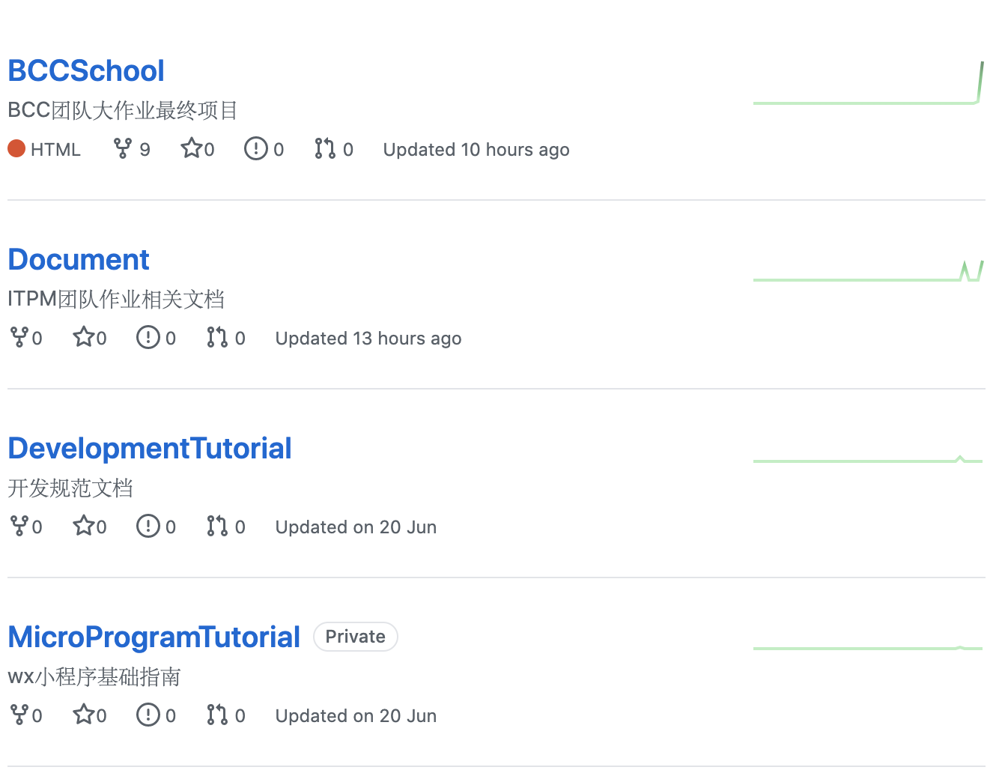
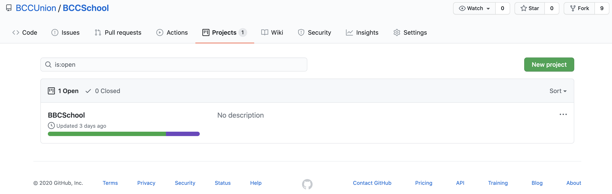
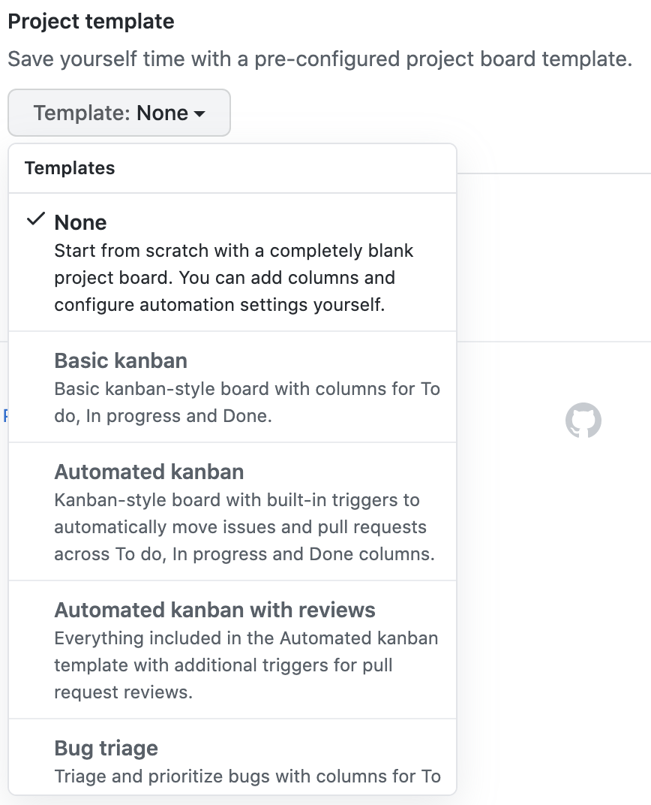
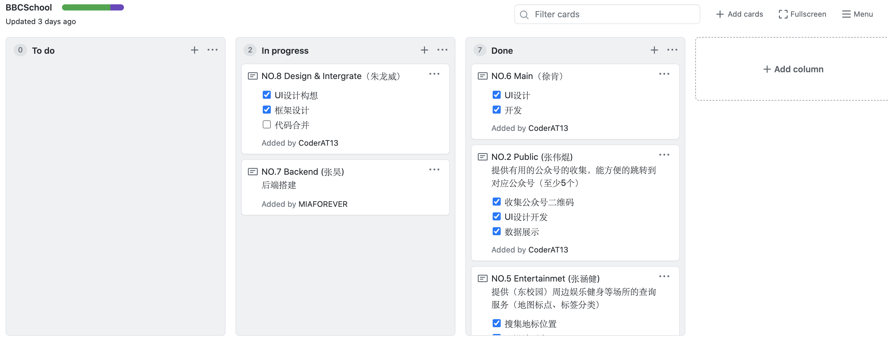
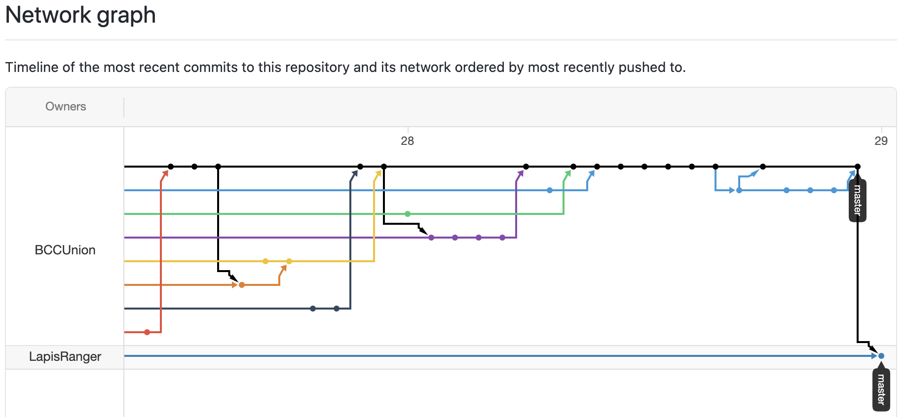

# 2020 ITPM课程期末管理经验报告

> - **Name:** 张涵健
> - **Sid:** 17343147

## 一、个人角色

在本学期的团队项目管理中，我担任了开发组组长的角色，负责对开发组组内成员进行管理。并在小组需求讨论时，引导小组有关技术方面的意见及参考。

## 二、负责内容

1. 根据产品需求，对需求进行WBS划分及贡献评估
2. 组织小组成员进行任务分工
3. 搭建GitHub组织及仓库并进行管理
4. 搭建并管理开发组任务进度看板
5. 测试产品

## 三、开发组技术报告

> GitHub是个优秀的项目管理工具

### 3.1 组织/团队

在GitHub之中，我们能够免费建立开发者团队（Organization），在团队之中，我们可以共同开发管理组织内的仓库，这样可以大大减少每次新建仓库时拉入合作者的工作，提高工作效率。在组织团队中，我们可以看到组织的所有仓库，这有利于我们进行管理。

[GitHub组织操作指南](https://docs.github.com/cn/enterprise/2.20/admin/user-management/organizations-and-teams)

### 3.2 仓库分类

1. 主产品开发仓库
2. 需求&管理文档
3. 技术参考文档

### 3.3 仓库Project的使用

新建Project之后，我们可以根据需要，能通过现有模版（Templates）创建我们的项目看板来管理我们项目的进度

看板是一个非常好的工具，在课程的项目时间管理之中，我认为看板是最有用的工具，在甘特图等确定好项目的里程碑后，能够调动人员，细化到人员的项目时间管理、进度管理工具就是看板了。

以我们项目看板为例，在每个人的任务都比较简单时，我们就仅使用一个看板来管理我们的进度。项目的管理者（开发组组长、项目经理）需要每天定时查看看板的进度，对于进度不合理的成员需要进行提醒或者绩效评估。

### 3.4 仓库开发技巧

对于一个Git项目的基本操作，我们需要弄清概念，master分支、fork、branch

从原理上来讲，fork和branch之间基本是等价的。区别是fork是copy到自己的仓库，而branch分支是在主仓库中copy主分支，在合并、冲突管理上操作是一致的。

Git实际上是一个文件操作时间队列，对于从同一个时间节点分出的两条不同的分支，只要没有在分开后修改/删除/增加同一个名称的文件就不会引起冲突。

使用git时，要时刻记得在自己任务的里程碑（版本更新）处commit，这样子git是可以在未来版本出错时回溯到自己原先的版本之中的。

#### 3.4.1 Insights的应用

在Insights中，我们可以看到仓库的状态及每个成员的版本贡献比例以及仓库的活动历史。

其中网络分支图是最直观的版本控制工具，能够清楚看到在什么时间点、谁、做了什么修改，能够溯源问责。

## 四、管理经验分享

在本次ITPM课程中，我们学习到了很多的项目管理技巧，包括从甲方的角度，分析市场需求与同类产品，合理且高效地提供需求清单及时间安排；从乙方的角度，如何与甲方进行沟通，如何向甲方交付产品、如何与开发团队协调等。

### 4.1 WBS很重要

工作包分割是进行合理分工、里程碑确立、软件测试以及产品交付的基础，良好的WBS能够大大地降低团队的开发成本，提高产品的质量以及开发的效率。

在进行WBS时，最重要的是对工作包的细分程度，需要把工作包分得不可再分才算合理的划分，这里的“不可再分”对于工作树的叶节点来说，强调的是内容的不可再分而不是流程的不可再分。

### 4.2 甘特图，项目流程的核心

在进行了WBS划分后，较为重要的点是项目里程碑的确定，这里使用甘特图是非常好的工具，它能够使团队负责人清晰地把握每个时间段的进度安排，调整掉配人员、资源以及产品阶段性交付。

### 4.3 看板，最优秀的监工

在我们团队项目管理之中，我们仅在开发组内使用看板工具，效果非常好，在有看板的情况下，通过看板与仓库中实际的内容进行照应，能够清楚地监督开发团队中每个成员的开发进度，按时按点地完成里程碑。
