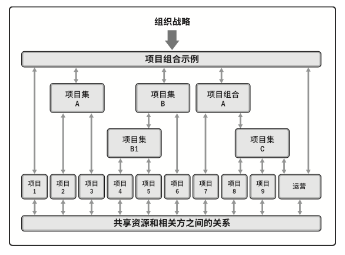
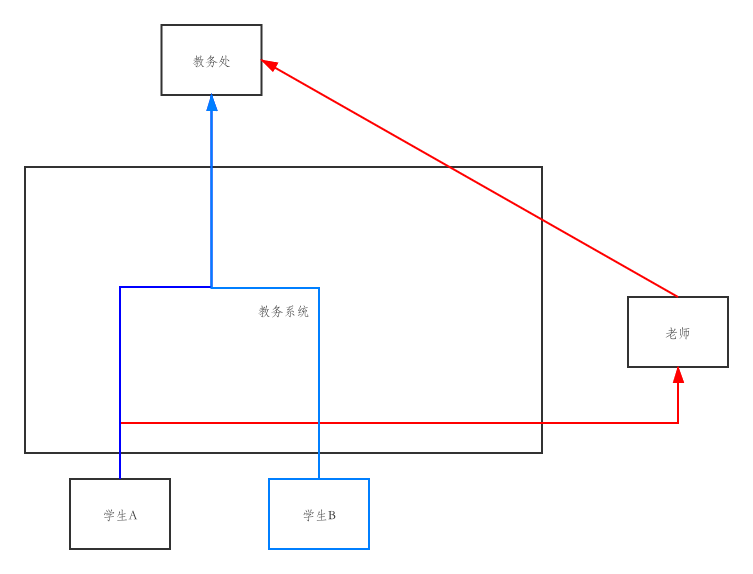

# 企业信息化重要性分析

## 题目

有人说企业信息化是“一把手工程”。通过网络搜索IT项目缺乏高级管理层支持失败案例，运用思维导图或系统模型描述高级管理层支持的重要性

## 正文

组织、项目、工程都有一个共同特点---金字塔化。在金字塔体系结构中，有顶层的领导者，也有中层的平行部门以及底层劳动成员。在这种高度阶级化的组织关系中，最大的弊端在于顶层和底层之间的信息不对称。以史为鉴，古代封建王朝灭亡，很多是因为皇帝并不能直接了解到各个地方老百姓民生，要么自我膨胀灭亡，要么群臣腐败而灭亡。而系统性信息化能借助于网络，使得上层有便捷渠道接触到底下的工作进展以及工作状态，底层能向上级反馈工作问题等，实现信息双向交流。

从PMBOK6的项目组合、项目集、项目和运营的概念流图中可以理解出企业级项目的基本体系构造。其中，如从组织战略到项目4、5之间跨越了3级，若在逐层消息流模型中，这种信息交流的效率是非常低的，不符合当代工程开发的高效原则。因此在企业信息化中，对高级管理层支持能解决逐层信息交流中的低效问题，提高办公效率。

在企业信息化的管理之中，对高级管理层支持的实现，并非如传统社交软件一样，能直接联系到对方就行了，当然这也是必要的，比如企业通信录。虽然阶级式的逐层信息流过于低效，但这却解决了高层领导者信息过滤的问题，因此在传统体系结构中存在矛盾。而企业信息化就是为了解决信息不对称与信息过滤的问题的。在信息化的企业系统之中，需要针对具体的企业职能制定具体的功能。例如，校园网选课系统之中，科任老师只需要了解自身课程的学生参与情况，而学校教务部需要统筹所有学生最具体的选课，因此教务系统在以课为分类标准的组织体系中承担着衔接者的角色。

红线是系统提供的符合阶级式的信息交流，而蓝线部分是教务系统所优化的阶级体系交流职能，自动化地为组织中层集合底层的信息汇总给上层。可以总结出，企业信息化管理需要做到自动化，把“信息过滤”这个步骤交给系统处理而非组织中间层处理。