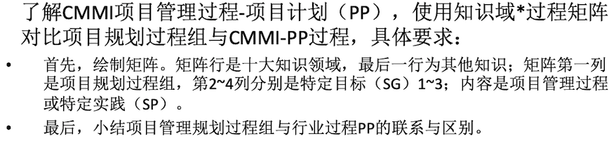
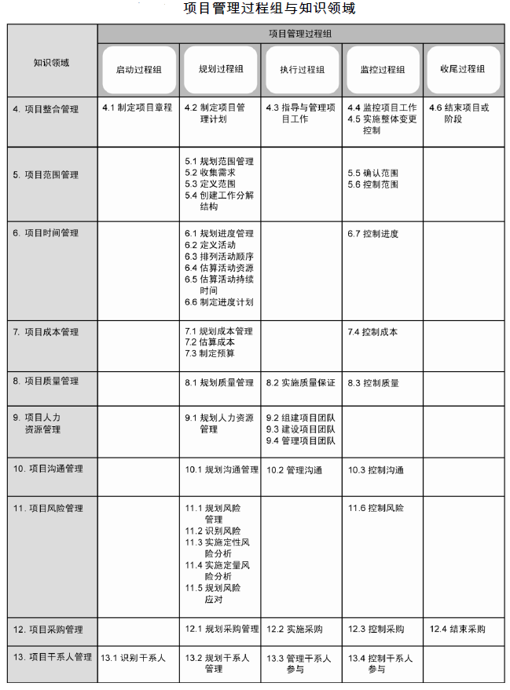

# 项目管理过程与领域知识及其关系

|  |  |
|---------|---------|
|姓名     |张涵健         |
|学号     |17343147         |
|邮箱     |969437072@qq.com         |

## 题目1

|知识领域  |项目规划过程组  |建立估计计划  |开发项目计划  |获得对计划的承诺 |
|---------|---------|---------|---------|-- |--|
|整合管理     |         |         |         |  |
|范围管理     |         |1.1估计项目范围|         |   |
|进度管理     |         |1.3定义项目生命周期         |2.1建立预算与进度         |   |
|成本管理     |         |1.4确定工作量和成本的估计；1.2建立项目属性估计|2.1建立预算与进度         |   |
|质量管理     |         |         |         |   |
|资源管理     |         |         |2.3 计划数据的管理；2.4 计划项目的资；2.5 计划所需的知识和技能源         |   |
|沟通管理     |         |         |2.6 计划项目相关人员的参与         |3.2 协调工作和资源   |
|风险管理     |         |         |2.2 标识项目风险         |   |
|采购管理     |         |         |         |   |
|相关方管理     |         |         |         |3.1 评审项目的附属计划 |

> 小结：项目管理过程组比CMMI-PP分工更详细，对工作的分工整体跟去耦合，而CMMI-PP更注重计划的设计

## 题目2

### 准备过程组：

#### 经理组：

1. 决定项目范围、时间、成本约束、项目业务场景
2. 沟通项目发起人
3. 确定项目分组结构

#### 技术组：

1. 了解业务场景，提供技术方案
2. 提供时间、成本评估
