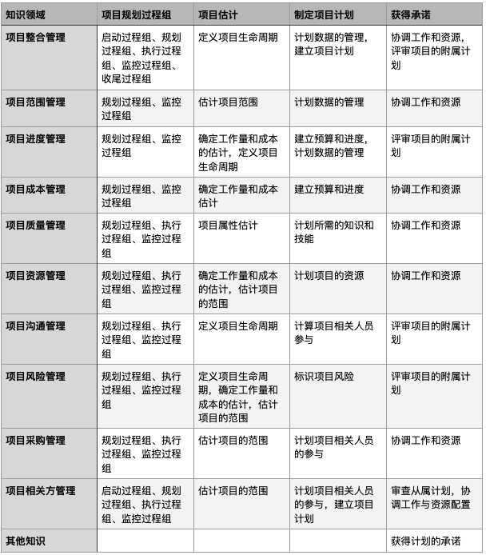

# 项目管理过程与领域知识及其关系

|  |  |
|---------|---------|
|姓名     |张涵健         |
|学号     |17343147         |
|邮箱     |969437072@qq.com         |

## 题目1

> 小结：项目管理过程组比CMMI-PP分工更详细，遵循时序性，对工作的分工整体和去耦合，而CMMI-PP更注重任务计划的设计，协调联系更高

## 题目2

### 准备过程组：

#### 经理组：

1. 决定项目范围、时间、成本约束、项目业务场景
2. 沟通项目发起人
3. 确定项目分组结构

#### 技术组：

1. 了解业务场景，提供技术方案
2. 提供时间、成本评估
3. 提供新颖或更方便的技术方案，并讨论研究
