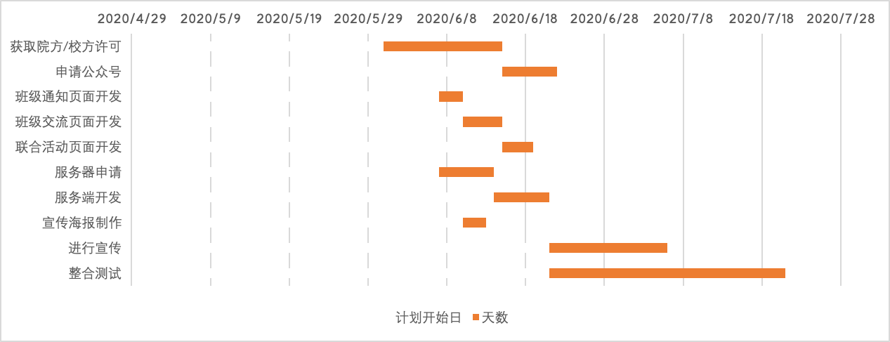
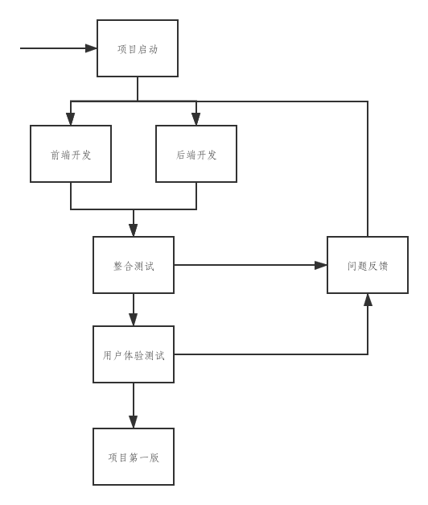
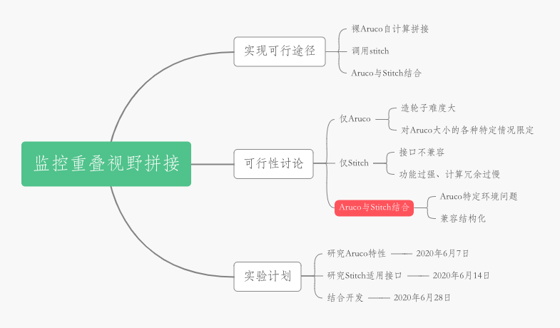

# HW4：分析与工具

## 题目一

> 你联合同学做一个年级微信公众号加强各班相互了解、联合活动等。请编制项目章程和项目管理计划，指导该项目实施与运营。 必须包含 WBS 和 甘特图;

### 项目章程

#### 一、基本信息

| |  |
|---------|---------|
|项目名称     |班级通公众号         |
|项目启动日     |2020年5月31日         |
|项目经理     |张涵健         |
|项目经理联系方式 |969437072@qq.com |
|版本号     |1.0.0         |
|更新时间|2020年5月31日 |

#### 二、项目背景

随着信息化管理在校园之中不断流行，从教务系统到图书馆系统、学生宿舍管理系统等，信息化正不断地渗透在大学生的学习生活之中。然而在班级之间的沟通交流方面的信息化管理仍处于原始阶段，通过辅导员汇集班委来进行信息交流，潜在信息化管理的发展市场。该项目能为辅导员提供系统性管理工具，为学生提供互相了解、联合活动的平台。

#### 三、项目目标

按照计划制成班级通微信公众号，通过微信官方审核，实现班级之间的信息化系统交流。

#### 四、整体项目风险

1. 未能取得学校、学院官方许可，无法通过微信官方审核。
2. 受微信平台开发限制，无法实现所有预期功能

#### 五、可交付结果

适用于中山大学所有行政班的，具备班级通知、班际联系、联合活动等功能的微信公众号

#### 六、预算

该项目预算为1000 RMB，可根据需要增资。项目主要成本为人工费用与服务器费用。

#### 七、里程碑进度计划

- 6月15日前成功申请微信公众号
- 6月30日前整合上线第一版

#### 八、相关方名单

|姓名  |角色  |职位  |联系方式 |
|---------|---------|---------|---------|
|张涵健     |项目经理、项目发起人  |负责计划、监控项目、对项目质量负责         |**@qq.com         |
|张三     |宣传负责人         |推广公众号         |***         |
|李四     |后端开发者         |开发后端         |***         |
|王五     |前端开发者         |开发前端         |***         |
|赵六     |公众号运维经理         |负责公众号申请、运维         |***         |

### 项目计划

#### 一、概述

- **目的**  
计划管理制成班级通微信公众号，通过微信官方审核，实现班级之间的信息化系统交流。  

- **项目可交付物**  
项目可交付能长期运行且功能完善的班级通微信公众号。  

- **项目预算**  
700 RMB 人力工资  
300 RMB 服务器费用  

#### 二、项目组织

- **外部接口**  
数据科学与计算机学院团委/中山大学团委

- **内部结构**  
项目经理  
｜--- 前端开发  
｜--- 后端开发  
｜--- 宣传  
｜--- 公众号运营

- **角色与职责**  

|姓名  |角色  |职位  |联系方式 |
|---------|---------|---------|---------|
|张涵健     |项目经理、项目发起人  |负责计划、监控项目、对项目质量负责         |**@qq.com         |
|张三     |宣传负责人         |推广公众号         |***         |
|李四     |后端开发者         |开发后端         |***         |
|王五     |前端开发者         |开发前端         |***         |
|赵六     |公众号运营经理         |负责公众号申请、运维         |

#### 三、控制过程计划

##### 1. 启动计划

项目经理向院方/校方获取许可

前端、后端开发者了解框架，初步定义前后端服务接口

##### 2. WBS

- 班级通公众号
- - 公众号申请
- - - 获取院方/校方许可  15天
- - - 向微信申请公众号  7天
- - 前端开发
- - - 班级通知页面  3天
- - - 贴吧式班级交流页面  5天
- - - 联合活动页面  4天
- - 后端开发
- - - 服务器申请  7天
- - - 服务端开发  7天
- - 公众号宣传
- - - 宣传海报制作  3天
- - - 进行宣传  15天
- - 整合测试 30天

##### 3. 甘特图

##### 4. 风险计划

未获得院方/校方许可时，开发个人级公众号，了解微信接口限制与计划冲突

##### 5. 技术过程计划

- 过程模型

- 方法、工具与技术

VSCode、Spring、React、Photoshop

- 产品验收

公众号各功能正常运行

## 题目二

> 召开一个项目策划研讨会，每个人用思维导图记录会议内容，该图必须满足“话题跟踪、热点标注、要点排序、问题汇总”四个基本要求。最后，给出这样会议记录的优点与缺点。

### 项目

监控重叠视野拼接

### 项目简述

垂直俯视监控摄像头重叠视野拼接，实现超广视野实时监控

### 思维导图

### 优点

1. 对会议的流程内容有清晰的结构性认识
2. 有效地引导会议讨论以及会议思维

### 缺点

1. 需要计算机辅助绘制图片，否则排版混乱、时间成本高
2. 适合层级式的会议内容，不适合循环性的会议讨论
3. 对于会议计划性的讨论结果不友好，需要引用计划相关的工具图，如：WBS、甘特图等。
