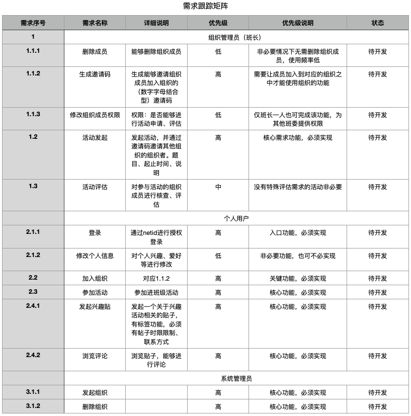
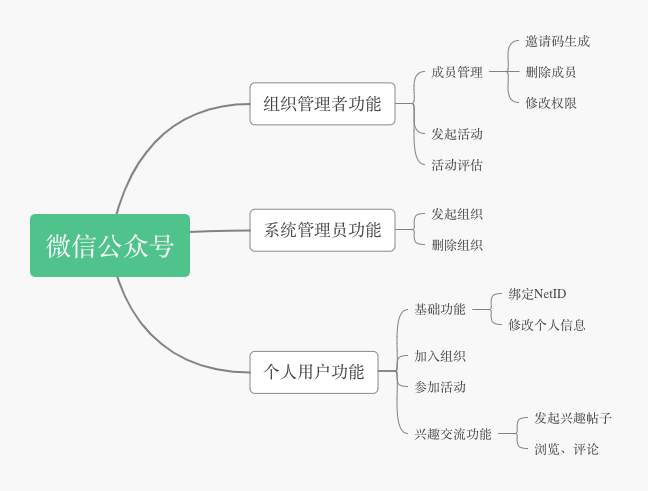

# HW5：收集需求与定义范围

## 题目一

> 你联合同学做一个年级微信公众号加强各班相互了解、联合活动 等。请写一份两页的报告，描述收集需求的方法，并附上收集的 需求跟踪矩阵(不少于五个需求)

### 需求收集的方法

> 需求收集（Collecting Requirements）是指定义并记录项目最终产品的特点和功能，以及创造这些产品的过程。需求收集阶段的输出是项目团队编制的利益相关者需求文档和需求跟踪矩阵。

#### 1、需求收集背景

随着信息化管理在校园之中不断流行，从教务系统到图书馆系统、学生宿舍管理系统等，信息化正不断地渗透在大学生的学习生活之中。然而在班级之间的沟通交流方面的信息化管理仍处于原始阶段，通过辅导员汇集班委来进行信息交流，潜在信息化管理的发展市场。该项目能为辅导员提供系统性管理工具，为学生提供互相了解、联合活动的平台。

#### 2、需求对象

产品是应用于班级之间的交流的，具有组织服务对象以及个人服务对象，针对不同的对象需要确定不同的面向对象的需求。

#### 3、需求收集方法

1. 访谈法（通过与班级班长以及宿舍同学之间进行访谈交流，获取需求的具体内容以及标准）
2. 观察法（对已有的核心需求、基本需求进行完善扩展，新增必要的伪需求）

#### 4、需求内容分析

通过对同学个人的访谈，了解到就个人受益者而言，此类能够增进同学间交流的软件，应该提供兴趣交流的功能，现今年轻人大多不喜欢直接询问对方兴趣、于是贴吧、某乎、微博等平台快速兴起，但由于这些平台的信息存在一定的虚假性，以及不能寻找到现实中与自己有交集的伙伴，因此部分大学生并不能通过此类平台寻找身边的同好者。因此对于校园类软件而言，个人信息的核实、发布信息的真假性征信系统等。

对于班级管理者的访谈，这类软件最大的问题是班内同学的动员性。在大学的班级里，班级的集体活动大多时的问题是班长无法切实地动员到同学进行，即使班级领导者之间能进行很好的沟通组织活动，但无法动员到班级里的同学的话，那么此类活动也将失去意义。因此，对于班级管理者的组织受益者角度而言，需要把班级成员的活动参与记录下来并进行透明公开，如此成员在进行类似团日活动评优等要求时目，能够提供证明材料。

#### 5、需求跟踪矩阵 RTM

## 题目二

> 使用思维导图，为作业1或2构建WBS，并使用项目管理工具制作 WBS或根特图。并按要求检查工作包的可管理性，分解完整性。 例如:检查测试、培训等

### WBS

### 工作包要求检查

1. 能计算出需求工作包完成时间
2. 能赋予(人力)资源，包括负责人（每个工作包可各由一个人完成）
3. 能给出成本预算模型（能估计时间成本、劳动力成本）
4. 它具有明确的任务或活动以及相关成果（有明确的交付结果页面）