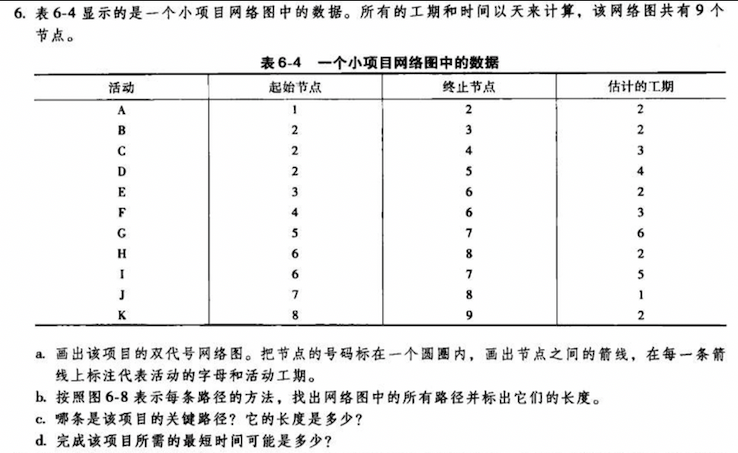
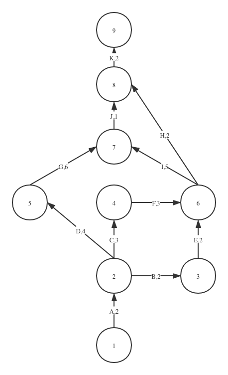
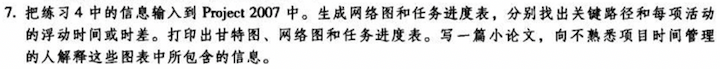
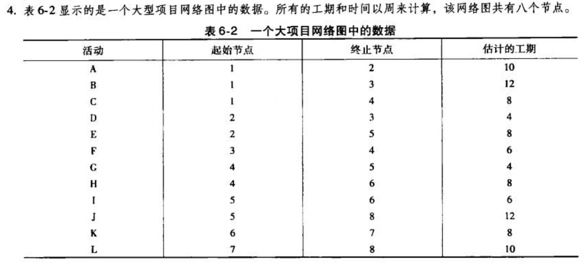
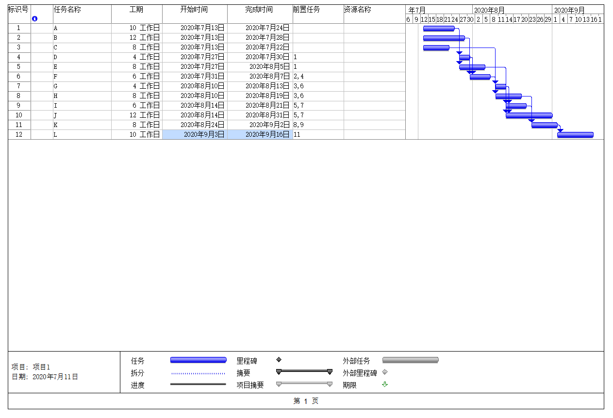
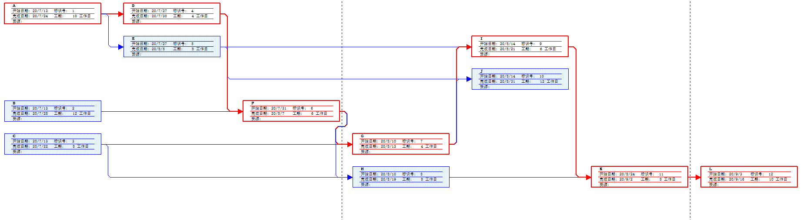
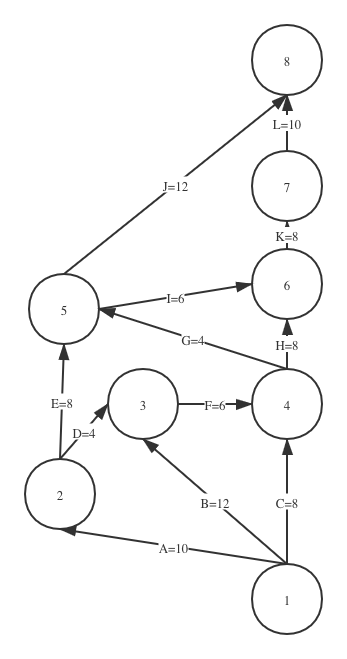
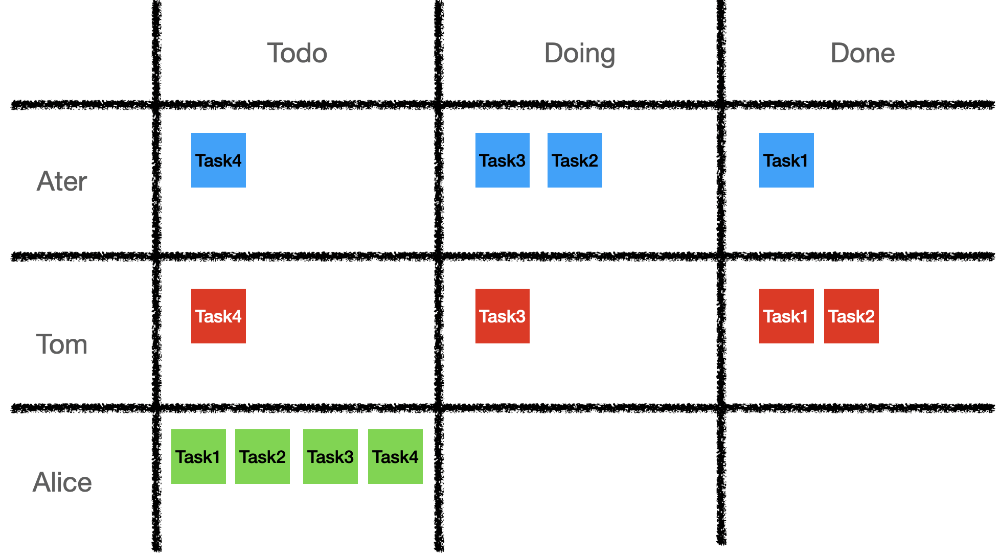
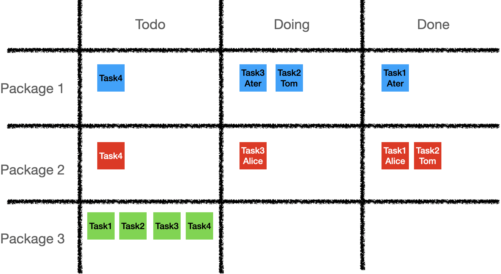

# HW6-项目时间管理

## 题目一

### (a)

### (b)

|序号  |路径  |长度  |
|---------|---------|---------|
|1     |A-B-E-H-K         |2+2+2+2+2 = 10         |
|2     |A-B-E-I-J-K         |2+2+2+5+1+2 = 14         |
|3    |A-C-F-H-K         |2+3+3+2+2 = 12         |
|4     |A-C-F-I-J-K          |2+3+3+5+1+2 = 16         |
|5    |A-D-G-J-K         |2+4+6+1+2 = 15         |

### (c)

关键路径是最长的路径，路径4:A-C-F-I-J-K 是关键路径，长度16

### (d)

所需最短时间可能是 16 （工期单位）

## 题目二

### 1.任务进度表与甘特图

任务进度表表示这个任务的安排或进展情况，在MS project中直接生成的任务进度表会智能地完成任务安排。
甘特图是一种时间管理中直观的时间安排图，能够清晰地看到各个活动时间安排的先后顺序。甘特图以图示通过活动列表和时间刻度表示出特定项目的顺序与持续时间。一条线条图，横轴表示时间，纵轴表示项目，线条表示期间计划和实际完成情况。直观表明计划何时进行，进展与要求的对比。便于管理者弄清项目的剩余任务，评估工作进度。

### 2.网络图

### 3.双代号网络图

关键路径：B-F-G-I-K-L 长度46

|任务号  |浮动时间  |
|---------|---------|
|A     |2         |
|B     |2         |
|C     |27         |
|D     |0         |
|E     |8         |
|F     |2         |
|G     |0         |
|H     |4         |
|I     |2         |
|J     |15         |
|K     |0         |
|L     |0         |

## 题目三

> 收集网上资料，总结看板在软件项目中的使用

### 3.1 基本概念

#### 3.1.1 看板

看板就是表示出某工序何时需要何数量的某种物料的卡片，又称为传票卡，是传递信号的工具。看板分两种，即传送看板和生产看板。传送看板用于指挥零件在前后两道工序之间移动。当放置零件的容器从上道工序的出口存放处运到下道工序的入口存放处时，传送看板就附在容器上。当下道工序开始使用其入口存放处容器中的零件时，传送看板就被取下，放在看板盒中。

#### 3.1.2 看板管理

看板管理亦称“看板方式”、“视板管理”。在工业企业的工序管理中，以卡片为凭证，定时定点交货的管理制度。“看板”是一种类似通知单的卡片，主 要传递零部件名称、生产量、生产时间、生产方法、运送量、运送时间、运送目的地、存放地点、运送工具和容器等方面的信息、指令。一般分为：在制品看板，它用于固定的相邻车间或生产线；信号看板，主要用于固定的车间或生产线内部；订货看板 (亦称“外协看板”)，主要用于固定的协作厂之间。

### 3.2 看板在项目中的载体

#### 3.2.1 实体白板/黑板

敏捷开发团队最常用的方式，也是最直接的一种看板类型，适合团队面对面工作交流时应用。

其优点是直观，能够时刻地提示成员工作进度，增强团队内部的竞争意识，提高团队效率。但不适合信息化管理，不能追溯历史记录来核验历史绩效。

工具：白板、列表、便利贴

#### 3.2.2 互联网看板

- Trello：[https://trello.com/](https://trello.com/)
- WeKan：[https://wekan.io/](https://wekan.io/)
- leangoo：[https://www.leangoo.com/](https://www.leangoo.com/)

### 3.3 看板在项目管理中的应用

#### 3.3.1 项目管理主导型

注重每个成员的原始任务分工，在明确了分工的前提下来管理每个成员的任务进度。这要求原始分工合理，然后才进行任务分配监督。

#### 3.3.2 成员主导型

按照 WBS 项目包对功能进行划分，鼓励成员主动承接任务，多劳多得。

### 4 总结

看版的作用主要是一种时间绩效激励型的管理工具。在管理层能够清楚了解到项目整体进度的同时，能够清楚地了解到成员的工作进度和状态。管理时，看板列表的列属性能够灵活替换增加，但基本上都是按照项目开发周期来设计的。