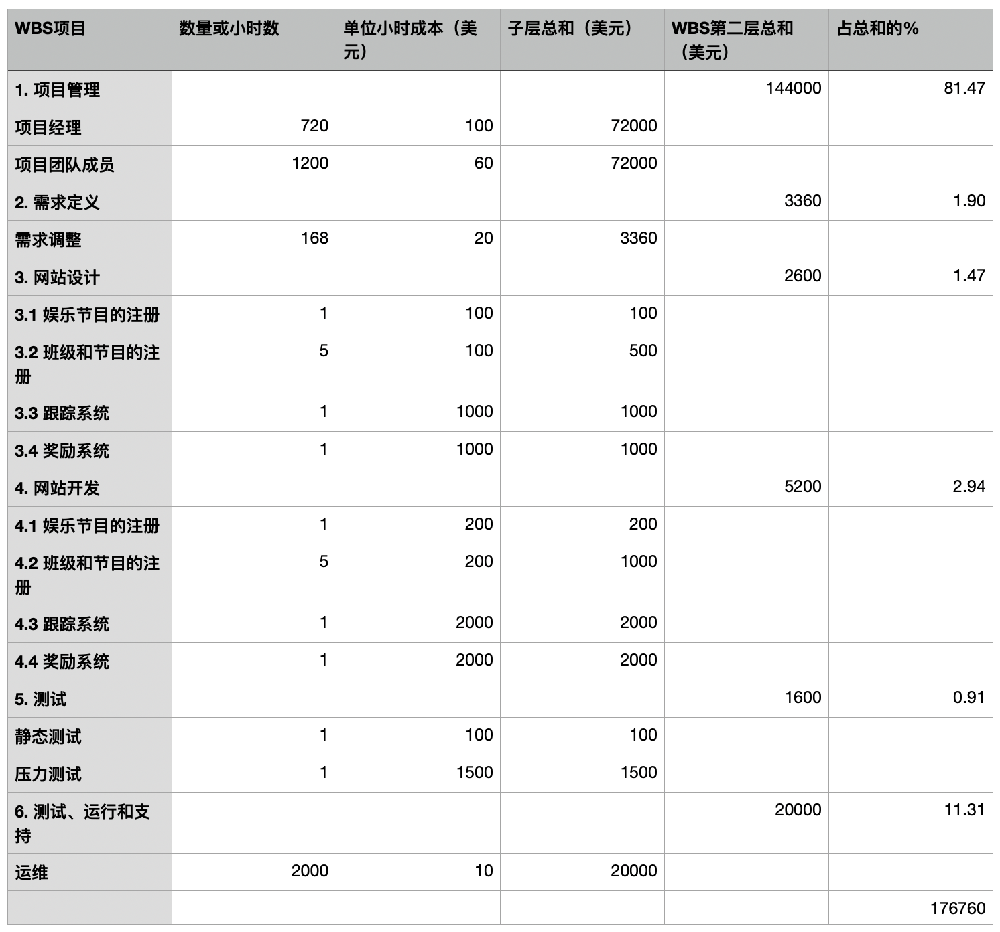
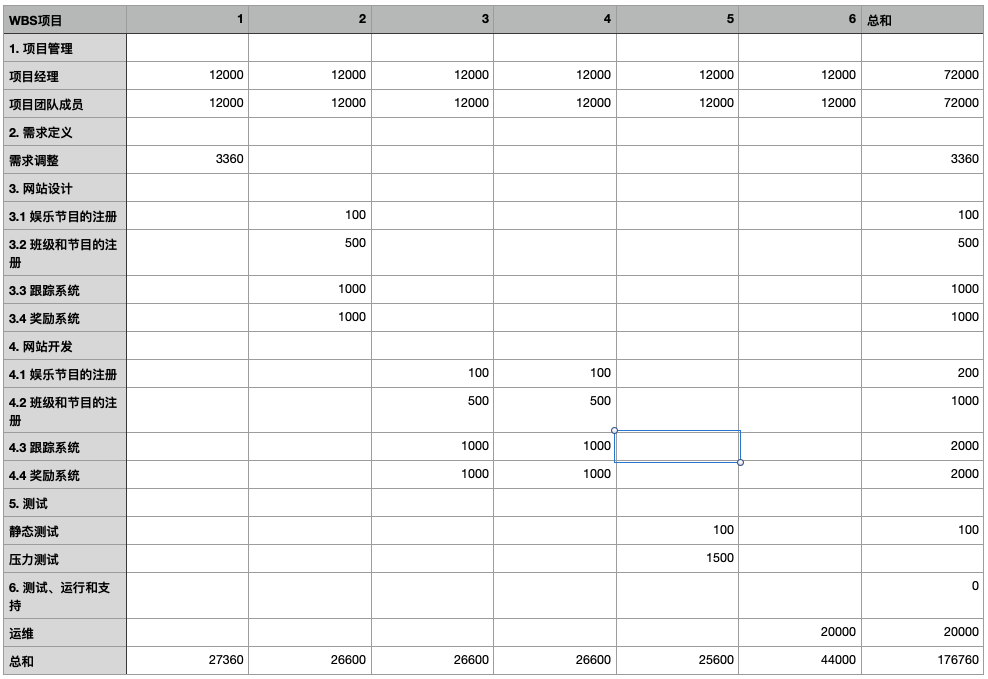

# HW7 项目成本管理

## 操作案例：

> Tony Prince 和他的团队正在做一个娱乐和健康方面的项目，他们被要求修改现有的成本估计，以便能有一个可靠的评价项目绩效的基线。你的进度和成本目标是在6个月内在200000美元的预算下完成项目。

## 题目一

> 准备和打印一页类似于图 7-2 的成本模型。试用一下WBS，并且确保记录下你在准备这个成本估计模型时所做的假设。假设项目经理的工资为100美元/小时，其他项目成员60美元/小时。假设没有工作外包，客户的劳动成本不包括在哪，并且没有额外的硬件成本。总体估计应该是200000美元。
> - 1. 项目管理
> - 2. 需求定义
> - 3. 网站设计
> - - 1. 娱乐节目的 
> - - 2. 班级和节目的注册
> - - 3. 跟踪系统
> - - 4. 奖励系统
> - 4. 网站开发
> - - 1. 娱乐节目的注册
> - - 2. 班级和节目的注册
> - - 3. 跟踪系统
> - - 4. 奖励系统
> - 5. 测试
> - 6. 测试、运行和支持



1. 假设项目经理有效工作时长为30天，成员有效工作时长为50天，才能使人员成本在200000以内
2. 假设需求定义需要准确的时间调整，一星期的时间
3. 假设班级和节目注册共有5个
4. 假设网站设计的成本是开发的1/2
5. 假设测试只有压力测试和静态测试
6. 假设运维时间为2000小时
7. 假设有剩余2w以上的预算供弹性调整

## 题目二

> 使用你上面制作的成本模型，通过按WBS分配成本，为这个项目每个月制定成本基线



## 题目三

```
假设项目已做了3个月，而这个为其6个月的项目的BAC是200000美元，并且再假设以下几点。
PV = 120 000
EV = 100 000
AC = 90 000
a. 这个项目的成本偏差、进度偏差、成本绩效指数（CPI）和进度绩效指数（SPI）是多少？
b. 这个项目的运作情况如何？它是提前于进度还是落后于进度？它是在预算下还是超出了预算？
c. 使用CPI来计算这个项目的完工估计（EAC）。这个项目比计划表现得好还是差？
d. 使用进度绩效指数（SPI）来估计将花费多长时间才能完成这个项目。
```

### a

成本偏差（CV）= EV - AC = 10 000

进度偏差（SV）= EV - PV = -20 000

成本进度指数（CPI）= EV / AC = 111.1%

进度绩效指标（SPI）= EV / PV = 83.3%

### b

SV < 0 落后于进度，CV > 0 在预算下

### c

EAC = BAC / CPI = 180 000 美元

这个项目比计划表现得好

### d

time = SPI * 6 = 5 个月

估计花费5个月来完成这个项目