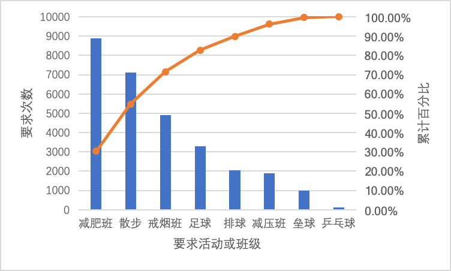

# HW8 项目质量管理

## 题目

## 作业1

> 制作一份质量标准或需求的清单，这些质量标准或需求与满足上面描述的利益相关者期望是相关的，并简单描述每一需求。例如，一个需求可能是系统推出两个兴起内90%的员工都能登录到系统中。

## 作业2

> 根据作业1中制作的清单，决定如何衡量满足这些需求的过程。例如，你可以吧员工登录系统作为培训疾患的一部分，然后跟踪谁参加了培训。你还可以在系统中建立一个特征，可以通过用户姓名、部门等跟踪用户量。

## 作业3

> 分析完调查信息后，决定制作帕累托图表，较为容易地看到人们对哪种类型的休闲活动及公司赞助的班级最感兴趣。

